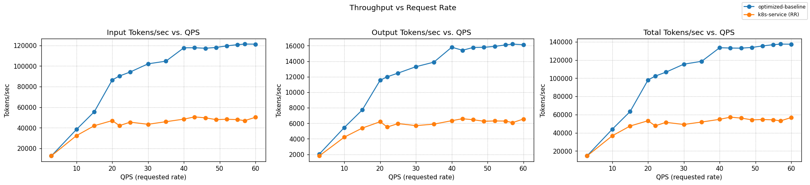
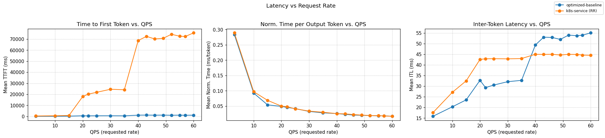
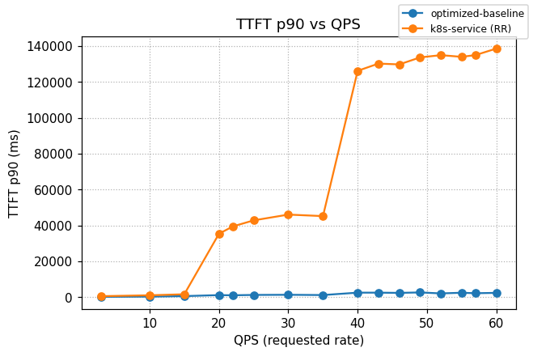

# Optimized Baseline

[](https://github.com/llm-d/llm-d/actions/workflows/nightly-e2e-optimized-baseline-ocp.yaml) [](https://github.com/llm-d/llm-d/actions/workflows/nightly-e2e-optimized-baseline-cks.yaml) [](https://github.com/llm-d/llm-d/actions/workflows/nightly-e2e-optimized-baseline-gke.yaml)

## Overview

This guide deploys the recommended out of the box [configuration](https://github.com/llm-d/llm-d-inference-scheduler/blob/main/docs/architecture.md) for most vLLM and SGLang deployments, reducing tail latency and increasing throughput through load-aware and prefix-cache aware balancing.

The optimized-baseline defaults to two main routing criteria:

- **Prefix-cache aware** using the [prefix cache scorer](https://github.com/llm-d/llm-d-inference-scheduler/tree/main/pkg/epp/framework/plugins/scheduling/scorer/prefix), which scores candidate endpoints by estimating prompt prefix cache reuse on each model server.

- **Load-aware** using both the [kv-cache utilization](https://github.com/llm-d/llm-d-inference-scheduler/tree/main/pkg/epp/framework/plugins/scheduling/scorer/kvcacheutilization) and the [queue size](https://github.com/llm-d/llm-d-inference-scheduler/tree/main/pkg/epp/framework/plugins/scheduling/scorer/queuedepth) scorers.

## Default Configuration

| Parameter          | Value                                                   |
| ------------------ | ------------------------------------------------------- |
| Model              | [Qwen/Qwen3-32B](https://huggingface.co/Qwen/Qwen3-32B) |
| Replicas           | 8                                                       |
| Tensor Parallelism | 2                                                       |
| GPUs per replica   | 2                                                       |
| Total GPUs         | 16                                                      |

### Supported Hardware Backends

This guide includes configurations for the following accelerators:

| Backend             | Directory                  | Notes                                      |
| ------------------- | -------------------------- | ------------------------------------------ |
| NVIDIA GPU          | `modelserver/gpu/vllm/`    | Default configuration                      |
| NVIDIA GPU (SGLang) | `modelserver/gpu/sglang/`  | SGLang inference server                    |
| AMD GPU             | `modelserver/amd/vllm/`    | AMD GPU                                    |
| AMD GPU (SGLang)    | `modelserver/amd/sglang`   | AMD GPU                                    |
| Intel XPU           | `modelserver/xpu/vllm/`    | Intel Data Center GPU Max 1550+            |
| Intel Gaudi (HPU)   | `modelserver/hpu/vllm/`    | Gaudi 1/2/3 with DRA support               |
| Google TPU v6e      | `modelserver/tpu-v6/vllm/` | GKE TPU                                    |
| Google TPU v7       | `modelserver/tpu-v7/vllm/` | GKE TPU                                    |
| CPU                 | `modelserver/cpu/vllm/`    | Intel/AMD, 64 cores + 64GB RAM per replica |

> [!NOTE]
> Some hardware variants use reduced configurations (fewer replicas, smaller models) to enable CI testing for compatibility and regression checks. These configurations are maintained by their respective hardware vendors and are not guaranteed as production-ready examples. Users deploying on non-default hardware should review and adjust the configurations for their environment.

## Prerequisites

- Have the [proper client tools installed on your local system](../../helpers/client-setup/README.md) to use this guide.
- Checkout llm-d repo:

  ```bash
    export branch="main" # branch, tag, or commit hash
    git clone https://github.com/llm-d/llm-d.git && cd llm-d && git checkout ${branch}
  ```

- Set the following environment variables:
  ```bash
    export GAIE_VERSION=v1.5.0
    export GUIDE_NAME="optimized-baseline"
    export NAMESPACE=llm-d-optimized-baseline
  ```
- Install the Gateway API Inference Extension CRDs:

  ```bash
    kubectl apply -k "https://github.com/kubernetes-sigs/gateway-api-inference-extension/config/crd?ref=${GAIE_VERSION}"
  ```

- Create a target namespace for the installation
  ```bash
      kubectl create namespace ${NAMESPACE}
  ```

## Installation Instructions

### 1. Deploy the llm-d Router

#### Standalone Mode

This deploys the llm-d Router in [Standalone Mode](placeholder-link):

```bash
helm install ${GUIDE_NAME} \
    oci://registry.k8s.io/gateway-api-inference-extension/charts/standalone \
    -f guides/recipes/scheduler/base.values.yaml \
    -f guides/${GUIDE_NAME}/scheduler/${GUIDE_NAME}.values.yaml \
    -n ${NAMESPACE} --version ${GAIE_VERSION}
```

<details>
<summary><h4>Gateway Mode</h4></summary>

To use a Kubernetes Gateway managed proxy rather than the standalone version, follow these steps instead of applying the previous Helm chart:

1. _Deploy a Kubernetes Gateway_ named by following one of [the gateway guides](../prereq/gateways).
2. _Deploy the llm-d router and an HTTPRoute_ that connects it to the Gateway as follows:

```bash
export PROVIDER_NAME=gke # options: none, gke, agentgateway, istio
helm install ${GUIDE_NAME} \
    oci://registry.k8s.io/gateway-api-inference-extension/charts/inferencepool  \
    -f guides/recipes/scheduler/base.values.yaml \
    -f guides/${GUIDE_NAME}/scheduler/${GUIDE_NAME}.values.yaml \
    --set provider.name=${PROVIDER_NAME} \
    --set experimentalHttpRoute.enabled=true \
    --set experimentalHttpRoute.inferenceGatewayName=llm-d-inference-gateway \
    -n ${NAMESPACE} --version ${GAIE_VERSION}
```

</details>

### 2. Deploy the Model Server

Apply the Kustomize overlays for your specific backend (defaulting to NVIDIA GPU / vLLM):

```bash
kubectl apply -n ${NAMESPACE} -k guides/${GUIDE_NAME}/modelserver/gpu/vllm/
```

<details>
<summary><h4>If you run into NCCL errors on GKE</h4></summary>

Try applying the patch:

```bash
kubectl apply -n ${NAMESPACE} -k guides/${GUIDE_NAME}/modelserver/gpu/gke-patch/vllm/
```

See [gke-patch/README.md](./modelserver/gpu/gke-patch/README.md) for more details.

</details>

<details>
<summary><h4>Other Accelerators</h4></summary>

```bash
# AMD GPU
kubectl apply -n ${NAMESPACE} -k guides/${GUIDE_NAME}/modelserver/amd/vllm/

# Intel XPU
kubectl apply -n ${NAMESPACE} -k guides/${GUIDE_NAME}/modelserver/xpu/vllm/

# Intel Gaudi (HPU)
kubectl apply -n ${NAMESPACE} -k guides/${GUIDE_NAME}/modelserver/hpu/vllm/

# Google TPU v6e
kubectl apply -n ${NAMESPACE} -k guides/${GUIDE_NAME}/modelserver/tpu-v6/vllm/

# Google TPU v7
kubectl apply -n ${NAMESPACE} -k guides/${GUIDE_NAME}/modelserver/tpu-v7/vllm/

# CPU
kubectl apply -n ${NAMESPACE} -k guides/${GUIDE_NAME}/modelserver/cpu/vllm/
```

</details>

### 3. (Optional) Enable monitoring

> [!NOTE]
> GKE provides [automatic application monitoring](https://docs.cloud.google.com/kubernetes-engine/docs/how-to/configure-automatic-application-monitoring) out of the box. The llm-d [Monitoring stack](../../docs/monitoring/README.md) is not required for GKE, but it is available if you prefer to use it.

- Install the [Monitoring stack](../../docs/monitoring/README.md).
- Deploy the monitoring resources for this guide.

```bash
kubectl apply -n ${NAMESPACE} -k guides/recipes/modelserver/components/monitoring
```

## Verification

### 1. Get the IP of the Proxy

**Standalone Mode**

```bash
export IP=$(kubectl get service ${GUIDE_NAME}-epp -n ${NAMESPACE} -o jsonpath='{.spec.clusterIP}')
```

<details>
<summary> <b>Gateway Mode</b> </summary>

```bash
export IP=$(kubectl get gateway llm-d-inference-gateway -n ${NAMESPACE} -o jsonpath='{.status.addresses[0].value}')
```

</details>

### 2. Send Test Requests

**Open a temporary interactive shell inside the cluster:**

```bash
kubectl run curl-debug --rm -it \
    --image=cfmanteiga/alpine-bash-curl-jq \
    --env="IP=$IP" \
    --env="NAMESPACE=$NAMESPACE" \
    -- /bin/bash
```

**Send a completion request:**

```bash
curl -X POST http://${IP}/v1/completions \
    -H 'Content-Type: application/json' \
    -d '{
        "model": "Qwen/Qwen3-32B",
        "prompt": "How are you today?"
    }' | jq
```

## Benchmarking

The benchmark launches a pod (`llmdbench-harness-launcher`) that, in this case, uses `inference-perf` with a shared prefix synthetic workload named `shared_prefix_synthetic`. This workload runs several stages with different rates. The results will be saved to a local folder by using the `-o` flag of `run_only.sh`. Each experiment is saved under the specified output folder, e.g., `./results/<experiment ID>/inference-perf_<experiment ID>_shared_prefix_synthetic_optimized-baseline_<model name>` folder

For more details, refer to the [benchmark instructions doc](../../helpers/benchmark.md).

### 1. Prepare the Benchmarking Suite

- Download the benchmark script:

  ```bash
  curl -L -O https://raw.githubusercontent.com/llm-d/llm-d-benchmark/main/existing_stack/run_only.sh
  chmod u+x run_only.sh
  ```

- [Create HuggingFace token](../../helpers/hf-token.md)

### 2. Download the Workload Template

```bash
curl -LJO "https://raw.githubusercontent.com/llm-d/llm-d/main/guides/${GUIDE_NAME}/benchmark-templates/shared_prefix.yaml"
```

### 3. Execute Benchmark

```bash
export IP=$(kubectl get service ${GUIDE_NAME}-epp  -n ${NAMESPACE} -o jsonpath='{.spec.clusterIP}')
```

<details>
<summary> <b>Click here for Gateway Mode</b> </summary>

```bash
export IP=$(kubectl get gateway llm-d-inference-gateway  -n ${NAMESPACE} -o jsonpath='{.status.addresses[0].value}')
```

</details>

```bash
envsubst < shared_prefix.yaml > config.yaml
./run_only.sh -c config.yaml -o ./results
```

## Cleanup

To remove the deployed components:

```bash
helm uninstall ${GUIDE_NAME} -n ${NAMESPACE}
kubectl delete  -n ${NAMESPACE} -k guides/${GUIDE_NAME}/modelserver/gpu/vllm/
```

## Benchmarking Report

The benchmark runs on 16× H100 GPUs, distributed across 8 model servers (2 H100s per server with TP=2).

<details>
<summary><b><i>Click</i></b> to view the report for <code>rate=60</code></summary>

```yaml
metrics:
  latency:
    request_latency:
      mean: 56.27
      p50:  56.81
      p90:  64.29
      p99:  68.16
      units: s
    time_to_first_token:
      mean: 1.147
      p50:  0.955
      p90:  2.372
      p99:  3.683
      units: s
    time_per_output_token:
      mean: 0.0551
      p50:  0.0556
      p90:  0.0625
      p99:  0.0664
      units: s/token
    inter_token_latency:
      mean: 0.0551
      p90:  0.1863
      p99:  0.4973
      units: s/token
  throughput:
    requests_per_sec:      15.99
    output_tokens_per_sec: 16128.6
    total_tokens_per_sec:  137355.0
```

</details>

### Comparing llm-d Routing to a Simple Kubernetes Service

Graphs below compare optimized-baseline routing to a stock Kubernetes Service that round-robins requests across the same 8 vLLM pods (no EPP, no scoring).





Summary across the full ladder (rates 3 → 60):

| Metric              | k8s service (RR) | LLM-d Optimized | Δ% vs k8s |
| :------------------ | :--------------- | :-------------- | :-------- |
| Output tokens/sec   | 5,722            | 12,848          | +124.5%   |
| Requests/sec        | 35.87            | 36.23           | +1.0%     |
| TTFT mean (s)       | 58.10            | 0.989           | −98.30%   |
| TTFT p90 (s)        | 107.43           | 2.026           | −98.11%   |
| ITL mean (ms)       | 44.0             | 47.0            | +6.8%     |

Saturation stage `rate=60`:

| Metric              | k8s service (RR) | LLM-d Optimized | Δ% vs k8s |
| :------------------ | :--------------- | :-------------- | :-------- |
| Output tokens/sec   | 6,551            | 16,129          | +146.2%   |
| Requests/sec        | 60.41            | 58.55           | −3.1%     |
| TTFT mean (s)       | 75.59            | 1.147           | −98.48%   |
| TTFT p90 (s)        | 138.66           | 2.372           | −98.29%   |
| ITL mean (ms)       | 45.0             | 55.0            | +22.2%    |
